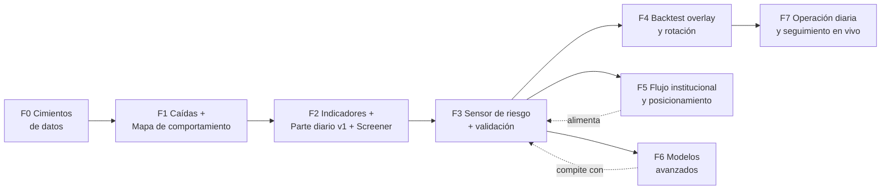

# Compomercado — Hoja de ruta

> **Sensor de comportamiento de mercado y sectores.** Mide qué tan frágil está el mercado, cómo se
> comporta cada sector, acción o canasta frente a las caídas, y hacia dónde rotar o cómo ajustar
> **sin frenar los trades que están funcionando**.

Documentos relacionados:

- [`docs/catalogo_variables.md`](docs/catalogo_variables.md): todas las variables candidatas por pilar, con fuente, historial y para qué sirven.
- [`docs/metodologia_backtest.md`](docs/metodologia_backtest.md): cómo se define una "caída", cómo se valida sin engañarse y cómo se mide el costo de avisar.
- [`config/universos.yaml`](config/universos.yaml) y [`config/canastas.yaml`](config/canastas.yaml): universo por defecto y canastas propias (borrador).

---

## 1. La idea en una página

El sistema responde **cuatro preguntas todos los días** al cierre:

| # | Pregunta | Módulo | Qué entrega |
|---|----------|--------|-------------|
| 1 | ¿Qué tan frágil o estresado está el mercado hoy? | **Sensor de riesgo** | Puntaje 0–100 por pilar y total, semáforo, probabilidad calibrada de caída y **qué lo está moviendo** |
| 2 | Si el mercado cae, ¿qué cae más y qué aguanta? | **Mapa de comportamiento** | Beta bajista/alcista, captura bajista, correlación en estrés, comportamiento en cada caída histórica, ranking de "refugio" y de "rebote" |
| 3 | ¿Hacia dónde rotar o cómo ajustar? | **Motor de rotación / overlay** | Exposición sugerida (gradual), sectores refugio **que además tengan fuerza relativa**, coberturas que funcionaron en regímenes parecidos, señales de reentrada |
| 4 | ¿Qué está haciendo el dinero grande? | **Flujo y posicionamiento** | Posicionamiento en futuros (COT), short volume fuera de bolsa (tipo DIX), días de distribución, flujos mecánicos estimados (CTAs, fondos de control de volatilidad) |

Todo pasa por un **motor de backtesting**: ninguna variable ni regla entra al sensor si no demuestra, fuera de muestra, que aporta información **y** que su costo (alertas falsas, subas perdidas) es aceptable.

### Qué NO es

- No es un sistema que adivina el día del crash. Los shocks exógenos (COVID, aranceles) no se anticipan con precisión. El valor está en **estar menos expuesto cuando las condiciones son frágiles**, **reaccionar rápido cuando el estrés empieza** y **saber de antemano a dónde rotar**.
- No ejecuta órdenes ni cierra posiciones. Da contexto, probabilidades y sugerencias; la decisión es del operador.
- No es un filtro binario que bloquea todo. Ver principio 1.

---

## 2. Principios de diseño

1. **Contexto, no veto.** La salida es un puntaje continuo y una sugerencia de ajuste (tamaño, stops, cobertura), no un "no operar". Un filtro binario solo se activa si el usuario lo pide y si el backtest lo justifica.
2. **Medir el costo de avisar.** Cada señal se evalúa por las caídas que evita **y** por las subas que se pierde: porcentaje del tiempo en alerta, cambios de estado por año, captura alcista resignada y trades ganadores que habría recortado.
3. **Riesgo antes que dirección.** La volatilidad y la probabilidad de cola izquierda se pronostican mucho mejor que la dirección del mercado. El sensor apunta a *condiciones* de riesgo.
4. **Los líderes no se filtran.** Una acción o sector que marca fuerza relativa mientras el mercado cae es información valiosa (suelen ser los próximos líderes). El overlay reduce primero lo que tiene alta beta bajista y fuerza relativa débil.
5. **Simple primero.** El punto de partida es un compuesto de indicadores normalizados, con el signo definido de antemano. Un modelo de machine learning se adopta solo si le gana al compuesto simple fuera de muestra.
6. **Point-in-time estricto.** Cada dato se usa solo desde el momento en que estaba publicado (COT sale el viernes con datos del martes, ATS con 2–4 semanas de demora, etc.).
7. **Explicable.** Cada alerta muestra qué componentes la empujan y qué la contradice.
8. **Todo backtesteable y registrado.** Cada indicador tiene una ficha y un test. Cada experimento queda registrado para poder corregir por cantidad de pruebas (data snooping).

---

## 3. Arquitectura

```mermaid
flowchart LR
    subgraph Fuentes
        Y[Yahoo / Stooq<br/>precios]
        F[FRED / ALFRED<br/>tasas, crédito, estrés]
        C[CBOE<br/>familia VIX, SKEW]
        K[Ken French<br/>industrias desde 1926]
        T[CFTC COT]
        N[FINRA<br/>short volume, ATS]
        S[SEC EDGAR<br/>Form 4, 13F]
        A[AAII / NAAIM]
    end

    Fuentes --> I[Ingesta<br/>proveedores + calidad]
    I --> D[(Almacén<br/>Parquet + DuckDB<br/>con fecha_disponible)]
    D --> X[Indicadores<br/>10 pilares]
    D --> E[Motor de caídas<br/>episodios y shocks]
    X --> R[Sensor de riesgo<br/>fragilidad · estrés · capitulación]
    E --> M[Mapa de comportamiento<br/>betas, captura, cola, lead-lag]
    X --> M
    R --> O[Rotación / overlay<br/>exposición, refugios, coberturas]
    M --> O
    R --> B[Backtesting y validación]
    O --> B
    B -. promueve / descarta .-> R
    R --> P[Salidas<br/>parte diario · dashboard · alertas · screener]
    M --> P
    O --> P
```



---

## 4. Universo

La lista completa está en [`config/universos.yaml`](config/universos.yaml). Resumen:

| Grupo | Ejemplos | Historial aprox. |
|-------|----------|------------------|
| Referencias EE. UU. | SPY, QQQ, IWM, DIA, RSP, MDY; ^GSPC | ^GSPC desde 1928, SPY desde 1993 |
| Volatilidad | ^VIX, VIX9D, VIX3M, VIX6M, VVIX, SKEW, MOVE, VXN, RVX, OVX, GVZ | VIX desde 1990 |
| Sectores (SPDR) | XLK, XLF, XLV, XLE, XLI, XLY, XLP, XLU, XLB, XLRE, XLC | 1998 (XLRE 2015, XLC 2018) |
| Industrias "canario" | SMH, IGV, XBI, KRE, ITB, XHB, XRT, IYT, XOP, XME, GDX, ITA | ≈2001–2006 |
| Factores / estilos | MTUM, QUAL, USMV, SPLV, SPHB, VLUE, IWF, IWD | ≈2000–2013 |
| Global | EFA, EEM, VGK, EWJ, FXI, KWEB, INDA, EWZ, EWW, EWY, EWT, ARGT + índices (^N225, ^HSI, ^GDAXI, ^STOXX50E, ^BVSP, ^MERV…) | ETF país desde 1996 |
| Renta fija y crédito | SHY, IEF, TLT, TIP, LQD, HYG, JNK, EMB, BKLN | ≈2002–2007 |
| Divisas | DXY, USDJPY, AUDJPY, EURUSD, USDCNH, MXN, BRL | décadas |
| Materias primas | Oro, plata, cobre, WTI, gas | ≈2000 (futuros) |
| Cripto | BTC, ETH (apetito de riesgo 24/7, señal de fin de semana) | 2014 |
| Historia larga | 49 industrias Fama-French (diario) | **1926** |
| **Canastas propias** | Definidas en YAML: mega caps, semis, ADRs argentinos, "mis posiciones"… | según componentes |

Las canastas propias admiten ponderación igual, por capitalización, por inversa de volatilidad o manual, y se analizan con las mismas métricas que un sector.

---

## 5. Módulos en detalle

### 5.1 Datos

- **Proveedores** intercambiables (un módulo por fuente), con descarga incremental y reintentos.
- **Almacén**: Parquet por serie + DuckDB para consultas. Cada registro guarda `fecha_dato`, `fecha_disponible` (cuándo se pudo conocer), `fuente` y `version`.
- **Calidad**: huecos, splits no ajustados, saltos anómalos, precios congelados y feriados (calendarios de bolsa). También la alineación horaria de mercados globales: Asia cierra antes de la apertura de EE. UU., y Europa se superpone con ella.
- **Datos pagos opcionales**, más adelante y solo si hacen falta: Norgate (constituyentes históricos y empresas deslistadas, clave para una amplitud sin sesgo de supervivencia), opciones (CBOE DataShop / ORATS) y EOD/intradía confiable (Tiingo, EODHD, Polygon).

### 5.2 Motor de caídas (eventos)

Genérico: funciona sobre cualquier referencia (SPY, QQQ, IWM, EFA, EEM, ^GSPC desde 1928, una canasta propia).

- **Episodios de drawdown** ≥ 5 %, 10 % y 20 %: pico → valle → recuperación, con profundidad, duración y velocidad.
- **Shocks diarios**: rueda ≤ −2 % o ≤ −2σ de la volatilidad de 63 días.
- **Spikes de volatilidad**: VIX +30 % en 5 ruedas, cruce de 30, inversión de la estructura temporal.
- **Fases de cada episodio**: pre-pico (63 ruedas antes), caída, capitulación, rebote y recuperación.
- **Huella macro de cada episodio**: qué hicieron tasas, dólar, petróleo, crédito, curva y yen. Permite agrupar las caídas por **tipo**: shock de tasas/inflación (2022), pánico de liquidez (2020, ago-2024), crédito/recesión (2008), crecimiento/Fed (2018 T4), geopolítico/político (2025), burbuja de valuación (2000). Así se puede responder *"en caídas de este tipo, ¿qué sectores defendieron?"*.

Episodios ≥ 10 % del S&P 500 desde 1998 (aproximados; el motor los recalcula): 1998 LTCM (≈−19 %), 2000–02 punto com (≈−49 %), 2007–09 crisis financiera (≈−57 %), 2010 flash crash/Europa (≈−16 %), 2011 rebaja de EE. UU. (≈−19 %), 2015–16 China/petróleo (≈−13 %), feb-2018 "Volmageddon" (≈−10 %), 2018 T4 Fed (≈−20 %), 2020 COVID (≈−34 %), 2022 inflación (≈−25 %), 2023 tasas (≈−10 %), 2025 aranceles (≈−19 %).

Son **pocos eventos grandes**. Por eso se usan también los de 5 %, los shocks diarios, otros mercados y la historia de 1926 (ver §9).

### 5.3 Mapa de comportamiento

Para cada activo, sector, factor, país o canasta, contra cada referencia:

| Métrica | Qué dice |
|---------|----------|
| Beta total, **beta bajista** (días de caída del mercado) y beta alcista; asimetría | Cuánto amplifica las caídas frente a las subas |
| **Captura bajista / alcista** | Qué parte de la caída y de la suba del mercado se lleva |
| Correlación móvil (21/63/252) y **correlación condicional en estrés** vs calma | Si la diversificación se rompe justo cuando hace falta |
| Dependencia de cola (co-excedencias), **MES** (retorno medio en el peor 5 % de días del mercado) | Comportamiento en los días extremos |
| **Por episodio**: retorno pico→valle, retorno relativo, drawdown propio, días hasta su propio piso, días de recuperación | Tabla completa por caída, no solo el promedio |
| **Tasa de acierto defensivo**: % de episodios en que le ganó al mercado | Consistencia; evita depender de un solo episodio |
| **Lead-lag de techos y pisos**: ¿hizo techo antes o después que el mercado? | Sectores "canario" que avisan (semis, bancos, transportes, small caps) |
| **Rebote**: retorno 21/63 ruedas después del piso | A qué volver cuando termina la caída |
| Comportamiento **según el tipo de caída** | El refugio de 2022 (energía) no fue el de 2020 (tecnología, salud) |
| Rotación relativa (RRG: RS-Ratio y RS-Momentum; cuadrantes líder, debilitándose, rezagado, mejorando) | Dónde está entrando y saliendo la fuerza relativa hoy |

Salen dos puntajes: **Refugio** (qué aguanta) y **Rebote** (qué lidera la salida).

La estructura de correlación entra como una capa aparte: matriz móvil, clusters jerárquicos, "número efectivo de apuestas" y correlación acciones-bonos. Esta última define si los bonos cubren o no: en 2022 no cubrieron.

### 5.4 Indicadores: diez pilares

Detalle completo en el [catálogo](docs/catalogo_variables.md):

1. **Volatilidad y opciones**: VIX (nivel y percentil), estructura temporal (VIX9D/VIX, VIX/VIX3M), VVIX, SKEW, prima de riesgo de volatilidad, MOVE, put/call.
2. **Crédito y financiamiento**: spreads Baa y high yield, HYG/IEF, excess bond premium, índices de estrés financiero (St. Louis Fed, NFCI, OFR), bancos regionales, liquidez neta de la Fed.
3. **Amplitud e internals**: % sobre 50/200 DMA, avance-descenso, máximos-mínimos, RSP/SPY, cíclicos/defensivos, sectores canario, **divergencias** (índice en máximos con amplitud cayendo).
4. **Tendencia y momentum**: SPY vs 200 DMA, drawdown actual, momentum de 1 a 12 meses, retorno overnight vs intradía.
5. **Cross-asset y macro**: curvas 10a−2a y 10a−3m, shock de tasas, dólar, **USDJPY/AUDJPY (desarme de carry)**, cobre/oro, petróleo, pedidos de desempleo, regla de Sahm, valuación.
6. **Global**: overnight de Asia y Europa antes de la apertura, % de mercados del mundo sobre la 200 DMA, EEM/SPY, China, yen.
7. **Flujo institucional y posicionamiento**: COT, short volume fuera de bolsa, ATS/dark pools, días de distribución, insiders, **flujos mecánicos estimados** (CTAs, control de volatilidad, ETFs apalancados, ventana de recompras, rebalanceo de fin de trimestre).
8. **Sentimiento** (contrarian en extremos): AAII, NAAIM, put/call, Fear & Greed.
9. **Estructura de correlación**: correlación promedio entre sectores, **absorption ratio**, **índice de turbulencia**, dispersión.
10. **Calendario**: FOMC, CPI, empleo, OPEX, vencimiento del VIX, fin de mes o trimestre, estacionalidad. Actúa como **modulador**, no como señal.

Cada indicador se normaliza *point-in-time* (percentil expansivo o z robusto calculado solo con el pasado) y se orienta para que "más alto = más riesgo".

### 5.5 Sensor de riesgo

Tres lecturas separadas, porque sirven para decisiones distintas:

| Lectura | Horizonte | Qué capta | Uso |
|---------|-----------|-----------|-----|
| **Fragilidad** | semanas a meses | Condiciones de fondo: amplitud divergente, crédito que no confirma, curva, concentración, complacencia | Ajustar exposición gradualmente, preparar la lista de refugios |
| **Estrés** | días | Algo ya está pasando: estructura del VIX invertida, turbulencia, spreads saltando, desarme de carry | Reaccionar rápido: stops, coberturas |
| **Capitulación / reentrada** | días | Miedo extremo + breadth thrust + normalización del VIX | **Volver a entrar** y no quedarse afuera |

Progresión de modelos. Cada uno debe ganarle al anterior **fuera de muestra**:

- **M0, baselines a batir**: SPY < 200 DMA; VIX > 20; VIX/VIX3M > 1.
- **M1, compuesto por pilares**: promedio de indicadores normalizados, sin optimizar pesos. Es robusto e interpretable.
- **M2, regresión logística regularizada** sobre los pilares, en walk-forward.
- **M3, gradient boosting** con restricciones monotónicas y SHAP para explicar.
- **M4, régimen con HMM** (calma, transición, estrés).
- **M5, analogías**: "hoy se parece a…" (vecinos más cercanos contra las huellas previas a cada episodio).

Objetivos a pronosticar (detalle en la [metodología](docs/metodologia_backtest.md)): caída máxima ≥ 5 % en las próximas 21 ruedas, ≥ 10 % en 63 ruedas, volatilidad realizada alta y VIX > 30.

El semáforo se calibra con **histéresis** (entrar a rojo exige más que salir) y **persistencia mínima**, para evitar señales que cambian todos los días.

### 5.6 Rotación, overlay y "no pisar trades"

| Salida | Cómo se construye |
|--------|-------------------|
| **Exposición sugerida** (continua, p. ej. 100 → 85 → 60 %) | Función del sensor + volatility targeting; nunca salta de 100 a 0 |
| **Refugios** | Ranking de refugio *según el tipo de caída análogo* **filtrado por fuerza relativa actual**, para no rotar a un defensivo que se está cayendo |
| **Qué reducir primero** | Posiciones con alta beta bajista, alta correlación en estrés y fuerza relativa debilitándose. **Los líderes con RS en máximos se mantienen** |
| **Coberturas** | Qué cubrió en regímenes parecidos (TLT, oro, dólar, yen, VIX, corto IWM), condicionado a la correlación acciones-bonos del momento |
| **Reentrada** | Breadth thrust, estructura del VIX normalizada, crédito estabilizado |

**Auditoría "no pisar trades"**: se importa el historial de trades propio (CSV del broker) y se mide, trade por trade, qué habría hecho el sensor:

- Qué porcentaje de ganadores habría recortado y cuánto P&L se perdía.
- Qué porcentaje de perdedores habría evitado y cuánto se ahorraba.
- **Cómo rinden tus trades en cada estado del sensor.** Si tus trades rinden bien en "amarillo", el sensor no debe reducir en amarillo **para vos**. La calibración se personaliza al estilo de cada operador.

### 5.7 Screener y canastas propias

- Consultas sobre la tabla de métricas, por ejemplo:
  `captura_bajista < 0.7 and rs_63d_pct > 70 and corr_estres_spy < 0.6` → "acciones que aguantan las caídas y hoy tienen fuerza".
- Screens predefinidos:
  - Refugios con momentum.
  - Canarios debilitándose.
  - Fortaleza en debilidad: RS en máximos con el mercado en drawdown.
  - Alta beta bajista en mis posiciones.
  - Correlación de mi cartera subiendo.
- Canastas propias en [`config/canastas.yaml`](config/canastas.yaml) con el mismo análisis que un sector: comportamiento en cada caída, beta bajista, correlación interna, diversificación efectiva.

### 5.8 Salidas: el parte diario

Ejemplo ilustrativo del formato; **los valores son ficticios**:

```
COMPOMERCADO · Parte diario · cierre 2026-09-22            (EJEMPLO — valores ficticios)

RIESGO  58/100  AMARILLO   (ayer 51 ▲7 · hace 1 semana 44)
  Fragilidad 64 ▲   Estrés 41 ▲   Capitulación 8
  Régimen (HMM): calma 55% · transición 38% · estrés 7%

PILAR                     punt.  Δ5d  motivo principal
  Volatilidad/opciones      45   +9   VIX/VIX3M 0.94 (contango se achica), VVIX p81
  Crédito                   38   +4   HYG/IEF −1.1% en 5d; spreads estables
  Amplitud                  72  +15   SPY a 1.2% del máximo con 46% > 50DMA  ← DIVERGENCIA
  Tendencia                 30   +2   SPY +6.8% sobre 200DMA
  Cross-asset/macro         55   +6   USDJPY −2.3% en 5d (riesgo de desarme de carry)
  Global                    61   +8   Asia −1.4% overnight; 9/20 mercados > 200DMA
  Flujos/posicionamiento    66  +10   6 días de distribución en 25; CTAs a −2.1% de su nivel de venta
  Correlación/estructura    58   +7   Absorption ratio p84
  En contra (calman):       AAII bulls 29% (miedo), COT asset managers sin extremo

LECTURA: fondo frágil, sin estrés agudo. Con perfiles parecidos (n=31 desde 1999) hubo caída ≥5%
en 21 ruedas el 34% de las veces (base: 18%).
OVERLAY: exposición 85% · mantener líderes · ajustar stops en alta beta bajista.

REFUGIOS (caída análoga: crecimiento/tasas)          REDUCIR PRIMERO
  XLP  captura↓ 0.45 · RS 3m ▲ · 11/13 episodios       SMH  beta↓ 1.8 · RS debilitándose
  XLV  captura↓ 0.60 · RS 3m = · 10/13 episodios       KRE  captura↓ 1.5 · correl. estrés 0.85

MIS CANASTAS
  mis_posiciones: beta bajista 1.35 · correlación interna 0.72 (▲) · 2 posiciones con RS en máximos → mantener

ALERTAS NUEVAS
  · Divergencia de amplitud (1ª en 34 ruedas) · VIX sube con SPY en suba 3 días seguidos
```

Formatos: reporte HTML o PDF diario, dashboard interactivo (Streamlit) y alertas por Telegram o email ante cambios de estado.

---

## 6. Fases



Cada fase termina con una **puerta de salida**: un criterio objetivo que hay que cumplir para avanzar. Las duraciones son orientativas, a tiempo parcial.

### Fase 0: Cimientos de datos (≈2 semanas)

- Estructura del repo, entorno (`uv`), lint, tests y CI.
- Configuración de universos y canastas en YAML, con validación.
- Proveedores v1: Yahoo (precios), FRED (tasas, crédito, estrés), CBOE (familia VIX, SKEW) y Ken French (industrias desde 1926).
- Almacén Parquet + DuckDB con `fecha_disponible` y actualización incremental.
- Calendarios de bolsa y alineación horaria de mercados globales.
- Controles de calidad con reporte.

**Entregable**: `compomercado datos actualizar` + reporte de calidad.
**Puerta**: series completas desde su inicio disponible, huecos explicados, tests verdes.

### Fase 1: Catálogo de caídas + Mapa de comportamiento (≈3 semanas). *Primer valor tangible.*

- Motor de eventos (drawdowns de 5, 10 y 20 %, shocks, spikes de VIX) sobre SPY, QQQ, IWM, EFA, EEM y ^GSPC desde 1928.
- Todas las métricas de §5.3 por activo × referencia × episodio.
- Huella macro y taxonomía de tipos de caída.
- Historia larga con 49 industrias Fama-French (1929, 1937, 1973–74, 1987…) para ver si los patrones sobreviven fuera de la era de los ETF.

**Entregable**: informe *"Cómo se comportan sectores, factores, países y activos en las caídas"*, ranking de refugio y rebote por tipo de caída, y tabla de *"quién hace techo primero"*.
**Puerta**: rankings estables entre subperíodos (p. ej. 1999–2012 vs 2013–hoy); resultados por episodio publicados (no solo promedios); tres episodios verificados a mano.

### Fase 2: Indicadores + Parte diario v1 + Screener (≈4 semanas)

- Pilares 1–6, 9 y 10 con datos gratuitos. La amplitud se calcula sobre el universo de ETFs, las 49 industrias y el S&P 500 actual (este último marcado con advertencia de sesgo de supervivencia).
- Normalización point-in-time y ficha por indicador (`docs/fichas/`).
- Canastas propias con sus ponderaciones.
- Screener sobre la tabla de métricas.
- Parte diario v1 en HTML y dashboard básico. Todavía descriptivo, sin calibrar, pero **utilizable desde el primer día como tablero de contexto**.

**Puerta**: test anti look-ahead: recalcular cualquier indicador en una fecha pasada con los datos truncados a esa fecha da el mismo valor. Cada indicador tiene su ficha.

### Fase 3: Sensor de riesgo y validación predictiva (≈4 semanas)

- Estudio de evento por indicador: trayectoria promedio de −126 a +63 ruedas alrededor de los picos, contra fechas aleatorias.
- Evaluación univariada contra los objetivos, en walk-forward, y mapa de redundancia entre indicadores.
- Baselines M0 vs compuesto M1 vs logística M2.
- Separación fragilidad / estrés / capitulación; semáforo con histéresis.
- **Presupuesto de alertas**: % de tiempo en rojo y cambios por año.

**Entregable**: sensor v1 con probabilidades calibradas + informe de validación.
**Puerta**: le gana a los baselines fuera de muestra (AUC-PR y días de anticipación) dentro del presupuesto de alertas; holdout sellado evaluado **una sola vez**; funciona en mercados no usados para diseñarlo (EFA, Nikkei, DAX).

### Fase 4: Backtesting de overlay y rotación (≈4 semanas)

- Motor de backtest: ejecución en t+1, costos, slippage, rebalanceos y dividendos.
- Estrategias:
  - (a) Exposición continua.
  - (b) Rotación defensiva condicionada a régimen + fuerza relativa.
  - (c) Coberturas según la correlación acciones-bonos.
  - (d) Reglas de reentrada.
- Auditoría "no pisar trades" sobre estrategias de referencia y sobre el historial de trades propio.
- Robustez: sensibilidad de parámetros, bootstrap por bloques, Deflated Sharpe, PBO, costos × 2 y demora de +1 día.

**Entregable**: informe de backtest con tabla por episodio + reglas de uso recomendadas.
**Puerta**: mejora del máximo drawdown y del Calmar sin resignar más captura alcista que la acordada; robusto a ±20 % en los parámetros; mejor que los baselines simples (200 DMA, volatility targeting).

### Fase 5: Flujo institucional y posicionamiento (≈4 semanas, puede ir en paralelo a F4)

- CFTC COT (TFF), FINRA short volume → índice tipo DIX, FINRA ATS, SEC Form 4, días de distribución y acumulación, volumen anómalo, overnight vs intradía, ubicación del cierre.
- **Flujos mecánicos estimados** a partir de precios: control de volatilidad, CTAs y sus niveles gatillo, ETFs apalancados, ventana de recompras, rebalanceo de fin de trimestre, OPEX.
- Cada señal pasa por el protocolo de la Fase 3 y **entra al sensor solo si agrega información incremental**.

**Puerta**: aporte incremental fuera de muestra demostrado, o se documenta y se descarta.

### Fase 6: Modelos avanzados (continuo)

- Gradient boosting monotónico + SHAP, HMM de régimen, analogías, DCC-GARCH y cópulas para la cola.
- Se promueven solo si le ganan al compuesto simple fuera de muestra, con Deflated Sharpe.

### Fase 7: Operación diaria y seguimiento en vivo (continuo)

- Pipeline automático post-cierre (GitHub Actions o servidor propio), alertas y dashboard.
- **Registro inmutable de señales en vivo**: el track record real, la única validación sin sesgo posible.
- Monitoreo de deriva de datos y del modelo, revisión trimestral y, opcionalmente, intradía.

---

## 7. Metas de éxito iniciales

Se ajustan después de la Fase 1, cuando se conozca la línea base real.

| Área | Meta |
|------|------|
| Sensor | AUC-PR fuera de muestra > baselines; anticipación mediana positiva ante caídas ≥ 10 %; ≤ 15–20 % del tiempo en rojo; ≤ 6–8 cambios de estado por año |
| Overlay | Máximo drawdown −30 % o más, conservando ≥ 85–90 % de la captura alcista; Calmar mejor en todos los subperíodos |
| Rotación | El refugio elegido le gana al mercado en ≥ 65 % de los episodios, fuera de muestra |
| Operación | Parte diario listo < 30 min después del cierre; cero bugs de look-ahead (tests) |

---

## 8. Stack técnico y estructura

**Python 3.11+**:

| Área | Paquetes |
|------|----------|
| Entorno | `uv` |
| Datos | `pandas`, `numpy`, `duckdb`, `pyarrow` |
| Descarga | `yfinance`, `httpx`, `exchange_calendars` |
| Estadística y modelos | `scipy`, `statsmodels`, `scikit-learn`, `arch` (GARCH/DCC), `hmmlearn`, `lightgbm`, `shap` |
| Visualización y dashboard | `plotly`, `streamlit` |
| CLI y configuración | `typer`, `pydantic` |
| Calidad | `pytest`, `ruff` |

Automatización diaria con GitHub Actions: sus runners tienen internet y pueden publicar el parte.

```
Compomercado/
├── ROADMAP.md
├── config/
│   ├── universos.yaml        # tickers por grupo
│   ├── canastas.yaml         # canastas propias
│   └── sensor.yaml           # pilares, umbrales, histéresis (F3)
├── docs/
│   ├── catalogo_variables.md
│   ├── metodologia_backtest.md
│   └── fichas/               # una ficha por indicador (F2+)
├── src/compomercado/
│   ├── datos/                # proveedores, almacén, calendarios, calidad
│   ├── universo/             # universos y canastas, ponderaciones
│   ├── indicadores/          # un módulo por pilar
│   ├── eventos/              # drawdowns, shocks, taxonomía de caídas
│   ├── analitica/            # betas, captura, cola, lead-lag, RRG, clusters
│   ├── sensor/               # normalización, pilares, compuesto, modelos
│   ├── rotacion/             # overlay, refugios, coberturas, auditoría de trades
│   ├── backtest/             # motor, walk-forward, purga, métricas, robustez
│   ├── reportes/             # parte diario, dashboard, alertas, screener
│   └── cli.py
├── notebooks/
└── tests/
```

---

## 9. Riesgos y límites

| Riesgo | Mitigación |
|--------|------------|
| **Pocos episodios grandes** (≈12 caídas ≥ 10 % desde 1998): poca potencia estadística | Usar caídas de 5 % y shocks diarios (cientos de eventos); otros mercados (Europa, Japón, emergentes); historia desde 1926; modelos simples con signos fijados de antemano; intervalos de confianza por bootstrap |
| **Sobreajuste / data snooping** | Holdout sellado, walk-forward con purga, registro de todos los experimentos, Deflated Sharpe y PBO, preferir mesetas de parámetros y no picos |
| **Cambios de régimen** (correlación acciones-bonos en 2022, recomposición de XLK/XLC en 2018, concentración en mega caps) | Métricas condicionadas a régimen, ventanas móviles, analizar por tipo de caída |
| **Datos gratuitos imperfectos** (yfinance no oficial, precios ajustados que cambian, amplitud con sesgo de supervivencia) | Proveedores intercambiables, fuente de respaldo, snapshots versionados, advertencias explícitas; opción de Norgate |
| **Demoras de publicación** (COT, ATS, 13F, encuestas) | `fecha_disponible` en cada dato y tests anti look-ahead |
| **Shocks exógenos** no anticipables | Pilar de estrés rápido + mapa de refugios preparado de antemano |
| **Falsa precisión** | Probabilidades con intervalos, tamaño de muestra visible (n=…) en cada afirmación |
| **Red bloqueada en el entorno cloud de esta sesión** para las fuentes de datos | Desarrollar aquí y correr las descargas localmente o en GitHub Actions, o habilitar esos dominios en la política de red del entorno |

---

## 10. Decisiones abiertas

1. **Horizonte operativo principal**: intradía, swing (días/semanas) o posición (meses). Define los objetivos (21 vs 63 ruedas) y si hace falta intradía.
2. **Mercados operados**: solo EE. UU., o también Argentina/LatAm (Merval, ADRs, CEDEARs).
3. **Presupuesto de datos**: 100 % gratis al inicio, o disposición a pagar (Norgate, opciones).
4. **Formato de uso diario**: dashboard, reporte por email, Telegram, planilla.
5. **Historial de trades** disponible para la auditoría "no pisar trades".
6. **Dónde corre**: PC local, servidor o GitHub Actions.

---

## 11. Referencias base

- Ang, Chen, Xing (2006), *Downside Risk*. Beta bajista.
- Kritzman, Li (2010), *Skulls, Financial Turbulence, and Risk Management*. Índice de turbulencia.
- Kritzman, Li, Page, Rigobon (2011), *Principal Components as a Measure of Systemic Risk*. Absorption ratio.
- Adrian, Brunnermeier (2016), *CoVaR*; Acharya, Pedersen, Philippon, Richardson (2017), *Measuring Systemic Risk* (MES).
- Bollerslev, Tauchen, Zhou (2009), *Expected Stock Returns and Variance Risk Premia*.
- Gilchrist, Zakrajšek (2012), *Credit Spreads and Business Cycle Fluctuations*. Excess bond premium.
- Moreira, Muir (2017), *Volatility-Managed Portfolios*; Faber (2007), *A Quantitative Approach to Tactical Asset Allocation*.
- Moskowitz, Ooi, Pedersen (2012), *Time Series Momentum*.
- Engle (2002), *Dynamic Conditional Correlation*; Hamilton (1989), cambios de régimen.
- López de Prado (2018), *Advances in Financial Machine Learning* (purga, embargo); Bailey, López de Prado (2014), *The Deflated Sharpe Ratio*; Bailey, Borwein, López de Prado, Zhu (2017), *The Probability of Backtest Overfitting*.
- SqueezeMetrics, papers sobre DIX y GEX; J. de Kempenaer, *Relative Rotation Graphs*.
